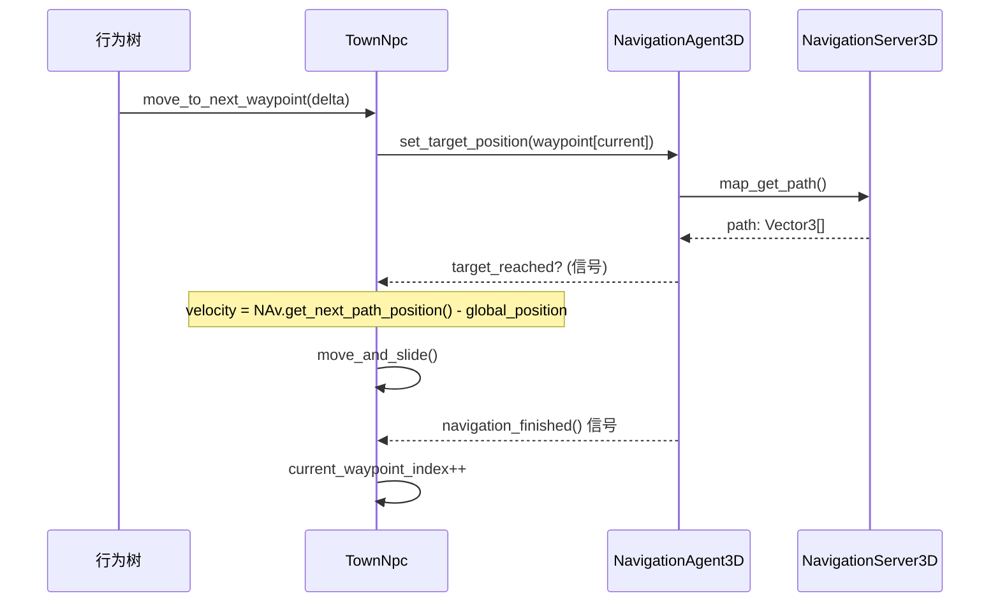

# NavMesh 导航系统 — 设计文档

> **版本:** v1.0
> **日期:** 2026-06-30
> **状态:** 草案

## 1. 概要

### 问题

当前 NPC 使用直接路径点（waypoint）导航，通过 `move_and_slide()` 直线移动。这导致：

- NPC 穿过建筑和地形
- 无法绕开障碍物
- 无法有效跟随地面起伏

### 目标

建立一个完整的 NavMesh 导航系统，实现：

1. **NavigationRegion3D** 覆盖全镇可行走区域（起伏地形 + 平地）
2. **NavigationAgent3D** 驱动所有 NPC 移动
3. **编辑器插件** 提供 NavMesh 工作流支持（创建、预览、一键烘焙）
4. NPC 行为树适配 NavigationAgent3D 的异步路径跟踪

### 范围

| 包含 | 不包含 |
|------|--------|
| Terrain3D 导航区域设置（用 Terrain3D addon 已有功能） | 运行时动态 NavMesh 更新 |
| TownGround 平地导航区域 | 动态障碍物回避 |
| NPC NavigationAgent3D 迁移 | 跳跃、降落导航链路 |
| 行为树动作适配 | NavMesh 网格导出/导入 |
| 编辑器工作流插件 | 多楼层/多层导航 |
| 单元测试覆盖 | 寻路性能调优 |

## 2. 现有资产分析

### 可行走表面

| 表面 | 类型 | 位置 | 备注 |
|------|------|------|------|
| Terrain3D | `Terrain3D` | `Main/TerrainContainer/Terrain3D` | 起伏地形，已使用 Terrain3D addon |
| TownGround | `StaticBody3D` (4块平面) | `Town/` 下直接子节点 | 6 块 30x25 的 PlaneMesh，构成市场街道区域 |

TownGround 在场景树中的位置：继承自 `scenes/prefabs/terrain/TownGround.tscn`，是 `Town.tscn` 的组成部分，最终被 `Main.tscn` 实例化。

### NPC 规格

| 参数 | 值 | NavMesh Agent 映射 |
|------|-----|-------------------|
| Capsule radius | 0.32 | agent radius = **0.30** |
| Capsule height | 1.55 | agent height = **1.55** |
| 最大移动速度 | 1.0 m/s | NavAgent max_speed = **1.0** |
| 路径点 | Array[Vector3] | NavigationAgent3D target_position |

### Terrain3D addon 已有的 NavMesh 功能

`addons/terrain_3d/menu/baker.gd` 已提供：

| 方法 | 功能 |
|------|------|
| `set_up_navigation()` | 创建 NavigationRegion3D，将 Terrain3D reparent 到其下，烘焙 NavMesh |
| `bake_nav_mesh()` | 重新烘焙已关联的 NavMesh |
| `find_terrain_nav_regions()` | 找到与 Terrain3D 关联的 NavigationRegion3D |
| `find_nav_region_terrains()` | 反向查找 |
| `_bake_nav_region_nav_mesh()` | 核心烘焙逻辑，解析源几何体 + Terrain3D 生成的面 |

这意味着 Terrain3D 的 NavMesh 不需要重复造轮子。

## 3. 架构设计

### 场景树变更

```diff
 Main.tscn
 ├── TerrainContainer
-│   └── Terrain3D
+│   └── NavigationRegion3D (terrain_nav)   ← 新建
+│       └── Terrain3D                       ← Terrain3D addon 自动创建
 ├── Town (instance)
+│   └── NavigationRegion3D (town_ground_nav) ← 新建
+│       └── TownGround (StaticBody3D 节点组)  ← 源几何体
 │   └── TownNpcGroup
-│       ├── TownNpc (CharacterBody3D)
+│       ├── TownNpc (CharacterBody3D + NavigationAgent3D) ← 添加 NavigationAgent3D
 │       └── ...
```

**关键设计决策：** Terrain3D 和 TownGround 使用**两个独立的 NavigationRegion3D**，但共享默认导航地图（Godot 自动行为）。这样各自独立烘焙，但 NPC 可以在两地之间无缝寻路。

### NavigationMesh 参数

#### Terrain3D NavMesh

| 参数 | 值 | 说明 |
|------|-----|------|
| cell_size | 0.25 | 水平精度 |
| cell_height | 0.2 | 垂直精度 |
| agent_radius | 0.30 | 匹配 NPC capsule radius - 安全余量 |
| agent_height | 1.55 | 匹配 NPC capsule height |
| agent_max_slope | 45.0 | 度，适合山丘地形 |
| agent_max_climb | 0.30 | 米，略小于 capsule height |
| region_min_size | 2.0 | 最小导航区域 |
| region_merge_size | 6.0 | 区域合并阈值 |
| edge_max_length | 4.0 | 最大边长 |
| edge_max_error | 0.3 | 边缘简化误差 |
| geometry_source_geometry_mode | 0 (ROOT_NODE_CHILDREN) | 从子节点获取几何体 |

#### TownGround NavMesh

| 参数 | 值 | 说明 |
|------|-----|------|
| cell_size | 0.20 | 平地精度更高 |
| cell_height | 0.15 | 平地垂直变化小 |
| agent_radius | 0.30 | 同上 |
| agent_height | 1.55 | 同上 |
| agent_max_slope | 30.0 | 平地坡度上限更低 |
| agent_max_climb | 0.15 | 平地台阶略低 |
| region_min_size | 1.0 | 更细粒度 |
| geometry_source_geometry_mode | 2 (GROUPS_WITH_CHILDREN) | 从 `nav_geometry` 组获取几何体 |

### NPC 导航流程



### 行为树调整

现有树结构保持不变：

```
Selector
├── PlayerBranch (Sequence)
│   ├── HasNearbyPlayerCondition
│   ├── LookAtPlayerAction
│   └── SpeakAmbientLineAction
├── WaitBranch (Sequence)
│   ├── IsAtWaypointCondition   ← 需要适配 NavAgent
│   ├── WaitAtWaypointAction    ← 基本不变
│   └── MoveToWaypointAction    ← 重写为 NavAgent 驱动
└── PatrolBranch (Sequence)
    └── MoveToWaypointAction    ← 同上，共享实现
```

## 4. 文件变更清单

### 新建

| 文件 | 职责 |
|------|------|
| `addons/navmesh_workflow/plugin.cfg` | 插件注册 |
| `addons/navmesh_workflow/plugin.gd` | EditorPlugin 生命周期，添加烘焙按钮 |
| `addons/navmesh_workflow/panels/navmesh_panel.tscn` | 底部面板场景 |
| `addons/navmesh_workflow/panels/navmesh_panel.gd` | 面板逻辑 |
| `tests/test_navmesh_workflow.gd` | 导航工作流测试 |
| `scripts/npc/NavHelper.gd` | 可选辅助类（如果 TownNpc 变得过大） |

### 修改

| 文件 | 变更 |
|------|------|
| `scenes/npc/TownNpc.tscn` | 添加 NavigationAgent3D 节点 |
| `scripts/npc/TownNpc.gd` | 添加 nav_agent 变量，重写移动/到达方法 |
| `scripts/npc/ai/MoveToWaypointAction.gd` | 适配 NavigationAgent3D |
| `scripts/npc/ai/IsAtWaypointCondition.gd` | 适配 NavigationAgent3D |
| `tests/test_town_npc.gd` | 更新 NavigationAgent3D 相关测试 |
| `scenes/main/Main.tscn` | 添加 Terrain3D 的 NavigationRegion3D |
| `scenes/town/Town.tscn` | 添加 TownGround 的 NavigationRegion3D + NavigationMesh 资源 |
| `project.godot` | 可选——配置 navigation/layers |

### 不会修改

| 文件 | 原因 |
|------|------|
| `scripts/npc/ai/WaitAtWaypointAction.gd` | 等待逻辑独立于导航 |
| `scripts/npc/ai/HasNearbyPlayerCondition.gd` | 玩家检测逻辑不变 |
| `scripts/npc/ai/LookAtPlayerAction.gd` | 注视逻辑不变 |
| `scripts/npc/ai/SpeakAmbientLineAction.gd` | 对话逻辑不变 |
| `scripts/npc/NpcDialogue.gd` | 无关 |

## 5. NavMesh 工作流插件

### 为什么需要插件

Godot 内置了 NavMesh 烘焙，但：
1. 创建 NavigationRegion3D + NavigationMesh 资源需要手动操作
2. Terrain3D 需要 `set_up_navigation()` 的特殊处理
3. 没有全镇覆盖的可视化概览
4. 每次场景修改后需要方便地重烘焙

### 功能

| 功能 | 实现方式 |
|------|---------|
| 一键设置 Terrain3D 导航 | 调用 Terrain3D addon 的 `baker.set_up_navigation_popup()` |
| 一键设置 Town Ground 导航 | 插件自己的 `setup_town_ground_nav()` |
| 烘焙所有导航区域 | 遍历场景中所有 NavigationRegion3D 并调用 bake |
| 覆盖可视化 | 底部面板显示每个 region 的 polygon count 和覆盖面积 |

### UI 布局

```
┌─────────────────────────────────────────────────────┐
│ [NavMesh Workflow]                                   │ ← 底部面板标签
├─────────────────────────────────────────────────────┤
│ 🏔 地形导航                                          │
│   [🔧 设置地形 NavMesh]  状态: ✅ 已设置              │
│   [🔄 烘焙地形 NavMesh]  多边形: 1,234               │
├─────────────────────────────────────────────────────┤
│ 🏘 城镇地面导航                                       │
│   [🔧 设置地面 NavMesh]  状态: ❌ 未设置              │
│   [🔄 烘焙地面 NavMesh]                               │
├─────────────────────────────────────────────────────┤
│ 🌐 全部烘焙            [🔥 烘焙所有]                   │
│ 最后烘焙: 2026-06-30 12:00                           │
└─────────────────────────────────────────────────────┘
```

## 6. NPC 迁移细节

### TownNpc.gd 变更

```gdscript
extends CharacterBody3D
class_name TownNpc

@export var npc_role := "pedestrian"
@export var move_speed_mps := 1.0
@export var player_sense_radius_m := 2.5
@export var wait_duration_s := 1.5
@export var waypoints: Array[Vector3] = []

var current_waypoint_index := 0
var last_spoken_line := ""
var nearby_player: Node3D
var wait_remaining_s := 0.0

# 新增
var _nav_agent: NavigationAgent3D
var _nav_target_reached := false


func _ready() -> void:
    var tree := $BehaviorTree as BeehaveTree
    if tree != null:
        tree.process_thread = BeehaveTree.ProcessThread.MANUAL
    if waypoints.is_empty():
        waypoints = [Vector3.ZERO]
    
    # 新增：初始化导航代理
    _nav_agent = $NavigationAgent3D as NavigationAgent3D
    if _nav_agent:
        _nav_agent.max_speed = move_speed_mps
        _nav_agent.target_reached.connect(_on_nav_target_reached)
        _nav_agent.velocity_computed.connect(_on_nav_velocity_computed)


func _physics_process(delta: float) -> void:
    # 原有的 BehaviorTree tick
    var tree := $BehaviorTree as BeehaveTree
    if tree != null and tree.enabled:
        tree.blackboard.set_value("delta", delta, str(get_instance_id()))
        tree.tick()
    
    # 新增：持续的 NavAgent 速度更新
    if _nav_agent and _nav_agent.is_navigation_finished() == false:
        var next_pos := _nav_agent.get_next_path_position()
        var new_velocity := (next_pos - global_position).normalized() * move_speed_mps
        _nav_agent.set_velocity(new_velocity)


func _on_nav_target_reached() -> void:
    _nav_target_reached = true
    velocity = Vector3.ZERO


func _on_nav_velocity_computed(safe_velocity: Vector3) -> void:
    velocity = safe_velocity
    move_and_slide()


func move_to_next_waypoint(delta: float) -> bool:
    if waypoints.is_empty():
        velocity = Vector3.ZERO
        return false
    if _nav_agent == null:
        # 回退到直接移动
        return _legacy_move_to_next_waypoint(delta)
    
    var target: Vector3 = waypoints[current_waypoint_index]
    if not _nav_agent.is_navigation_finished():
        # 正在移动中
        return true  # RUNNING
    if not _nav_target_reached:
        # 刚设置目标点
        _nav_agent.target_position = target
        _nav_target_reached = false
        return true  # RUNNING
    # 已到达
    _nav_target_reached = false
    return true  # 到达，由外部推进 waypoint


func is_at_waypoint() -> bool:
    if _nav_agent == null:
        return _legacy_is_at_waypoint()
    return _nav_target_reached or _nav_agent.is_navigation_finished()
```

### MoveToWaypointAction.gd 变更

```gdscript
extends "res://addons/beehave/nodes/leaves/action.gd"

func tick(actor: Node, blackboard: Blackboard) -> int:
    var delta: float = blackboard.get_value("delta", 0.016)
    if actor.has_method("move_to_next_waypoint") and actor.move_to_next_waypoint(delta):
        return RUNNING
    return FAILURE
```

对外接口不变，内部实现迁移到 TownNpc 内部。行为树脚本本身无需改动——这最小化了对行为树结构的侵入。

### IsAtWaypointCondition.gd 变更

类似地，接口不变，只需确认 actor 的 `is_at_waypoint()` 已适配 NavigationAgent3D。

## 7. 测试策略

| 测试 | 内容 | 方式 |
|------|------|------|
| `test_nav_agent_added` | 场景实例化后存在 NavigationAgent3D 节点 | `load("TownNpc.tscn").instantiate()` |
| `test_nav_agent_config` | target_reached 信号已连接 | 模拟信号触发 |
| `test_nav_movement` | move_to_next_waypoint 使用 NavAgent | mock NavigationAgent3D |
| `test_is_at_waypoint` | NavAgent 到达后 is_at_waypoint 返回 true | 模拟 navigation_finished |
| `test_fallback_no_nav` | 无 NavigationAgent3D 时回退到直接移动 | 不添加 NavAgent 节点 |
| `test_navmesh_region_creation` | NavigationRegion3D + NavigationMesh 创建成功 | 测试场景加载 |
| `test_editor_plugin` | 插件注册/注销不报错 | 模拟 EditorPlugin 生命周期 |

### 依赖限制

NavigationAgent3D 需要 `is_inside_tree()` 才能正常工作（它依赖于 NavigationServer3D）。在纯逻辑测试中，我们需要：

1. 将 NPC 加入场景树：`add_child(npc)`
2. 设置 NavigationServer3D 地图
3. 或者只测试 NavigationAgent3D 的接口调用（通过信号模拟）

推荐：单元测试只测 NPC 逻辑（接口调用 + 状态转换），集成测试（依赖场景树）单独标注。

## 8. 实施顺序

```
Phase 1 — NavigationRegion3D 设置
  └→ 步骤 1: 在 Main.tscn 中配置 Terrain3D 的 NavigationRegion3D
  └→ 步骤 2: 在 Town.tscn 中配置 TownGround 的 NavigationRegion3D

Phase 2 — NPC 迁移
  └→ 步骤 3: 修改 TownNpc.tscn（添加 NavigationAgent3D）
  └→ 步骤 4: 重写 TownNpc.gd 导航方法
  └→ 步骤 5: 适配 MoveToWaypointAction 和 IsAtWaypointCondition
  └→ 步骤 6: 更新测试

Phase 3 — 编辑器插件
  └→ 步骤 7: NavMesh 工作流插件

Phase 4 — 验证
  └→ 步骤 8: 完整测试 + 场景验证
```

## 9. 回退方案

如果 NavigationAgent3D 在某些情况下（如场景树未就绪）不能正常工作：

1. **Fallback 机制**: `move_to_next_waypoint()` 在 `_nav_agent == null` 时回退到原有的 `_legacy_move_to_next_waypoint()`
2. **安全性**: 所有 NavigationAgent3D 调用都有 null 检查
3. **测试兼容**: 现有测试通过不添加 NavAgent 节点来测试回退路径

## 10. 扩展性

### 未来可添加

- NavMesh 链接（连接地面 → 高台）
- 导航障碍物（NavigationObstacle3D）
- 局部回避（Avoidance）
- NPC 密度热力图
- 运行时动态区域更新

### 已知限制

- Godot 4.6 NavigationAgent3D 的 `velocity_computed` 信号只在 avoidance 启用时触发，如果不使用 avoidance，直接用 `move_and_slide()` 控制速度
- 头测试环境中 NavigationServer3D 不可用，需要 mock
